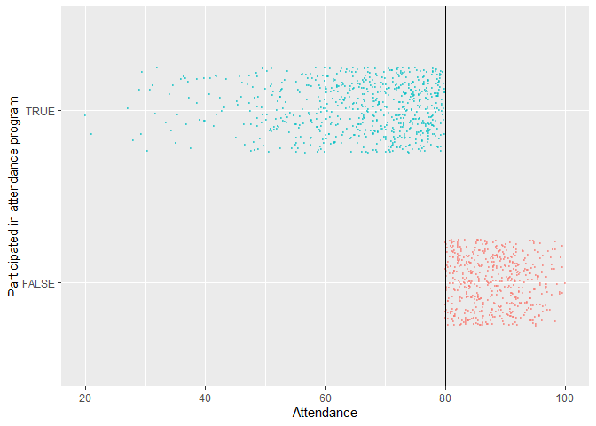
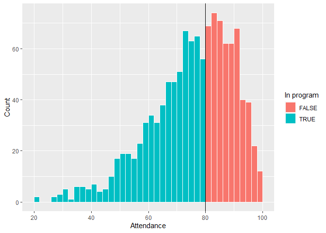
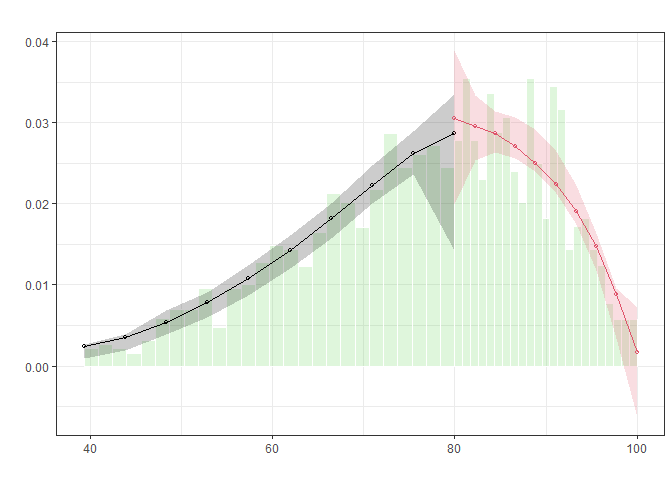
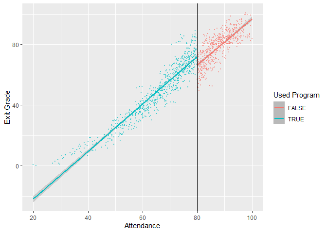
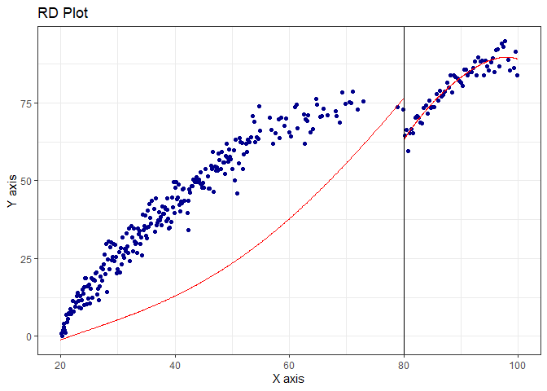
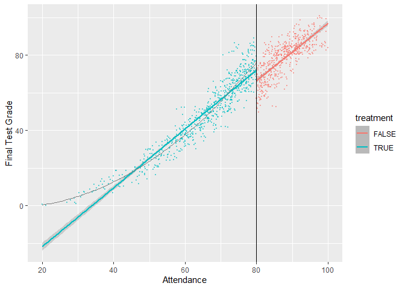

Regression Discontinuity Design
================
Lindsey Dorson

There is substantial research and evidence that [class attendance has a
positive and significant effect on student
performance](http://graphics8.nytimes.com/packages/pdf/nyregion/20110617attendancereport.pdf).
Because of this, state and local government agencies and school
districts have designed programs and policies that incentivize students
to not miss school days. Examples include tangible prizes like [colorful
pendants and free tickets to
events](https://www.nytimes.com/2011/06/17/nyregion/city-reduces-chronic-absenteeism-in-public-schools.html),
[automated calls from
celebrities](https://cityroom.blogs.nytimes.com/2011/02/10/schools-use-celebrity-robo-calls-to-battle-truancy/),
or [class policies that mandate
attendance](https://people.ucsc.edu/~cdobkin/Papers/2010%20Skipping%20class%20in%20college%20and%20exam%20performance%20Evidence%20from%20a%20regression%20discontinuity%20classroom%20experiment.pdf).

Existing research has used a range of methods to test the relationship
between attendance programs and student performance, including [simple
regression analysis](https://dx.doi.org/10.1016/j.sbspro.2016.07.051),
[randomized experiments](https://dx.doi.org/10.3200/JECE.39.3.213-227),
and [regression discontinuity
approaches](https://people.ucsc.edu/~cdobkin/Papers/2010%20Skipping%20class%20in%20college%20and%20exam%20performance%20Evidence%20from%20a%20regression%20discontinuity%20classroom%20experiment.pdf).

In this assignment, you will use regression discontinuity approaches to
measure the effect of a hypothetical program on hypothetical student
grades (this data is 100% fake).

In this simulated program, high school students who have less than 80%
attendance during their junior year (11th grade) are assigned to a
mandatory school attendance program during their senior year (12th
grade). This program requires them to attend school and also provides
them with additional support and tutoring to help them attend and remain
in school. At the end of their senior year, students take a final test
to assess their overall learning in high school.

The dataset I’ve provided contains four columns:

-   `id`: A randomly assigned student ID number
-   `attendance`: The proportion of days of school attended during a
    student’s junior year (ranges from 0 to 100)
-   `treatment`: Binary variable indicating if a student was assigned to
    the attendance program during their senior year
-   `grade`: A student’s final test grade at the end of their senior
    year

``` r
library(tidyverse)
library(rdrobust)
library(rddensity)
library(broom)
library(modelsummary)


options(dplyr.summarise.inform = FALSE)

program <- read_csv("data/attendance_program.csv")
```

# Step 1: Determine if process of assigning treatment is rule-based

**Was assignment to this program based on an arbitrary rule? Is it a
good candidate for a regression discontinuity approach? Why or why
not?**

Yes, because students assignment was based on an arbitrary rule.
Students who had below 80% attendance in their junior year were required
to attend the mandatory attendance program and students who had 80% or
above were not. Therefore, program participation is rule based.

# Step 2: Determine if the design is fuzzy or sharp

**How strict was the application of the rule? Did any students with
attendance above 80% get into the attendance program, or did any
students with attendance under 80% not get into the program? Is there a
sharp difference in treatment at the cutpoint?**

``` r
ggplot(program, aes(x = attendance, y = treatment, color = treatment)) +
  geom_point(size = 0.5, alpha = 0.5,
             position = position_jitter(width = 0, height = 0.25, seed = 12345)) +
  geom_vline(xintercept = 80) +
  labs(x = "Attendance", y = "Participated in attendance program") +
  guides(color = "none")
```

<!-- --> The
application of the rule looks sharp since all students got treatment if
they had below 80% attendance.

``` r
program %>%
  group_by(treatment, attendance <= 80) %>%
  summarize(count = n())
```

    ## # A tibble: 2 × 3
    ## # Groups:   treatment [2]
    ##   treatment `attendance <= 80` count
    ##   <lgl>     <lgl>              <int>
    ## 1 FALSE     FALSE                519
    ## 2 TRUE      TRUE                 681

Additional support for sharp design.

# Step 3: Check for discontinuity in running variable around cutpoint

Next, you should check that there was no manipulation in the running
variable. We don’t want to see a ton of students with 81% or 79%
attendance, since that could be a sign that administrators fudged the
numbers to either push students into the program or out of the program.

**Does it look like there’s an unexpected jump in the running variable
around the cutoff?**

``` r
ggplot(program, aes(x = attendance, fill = treatment)) +
  geom_histogram(binwidth = 2, color = "white", boundary = 80) +
  geom_vline(xintercept = 80) +
  labs(x = "Attendance", y = "Count", fill = "In program")
```

<!-- --> There doesn’t
appear to be any manipulation visually.

Next, conduct a McCrary density test with `rdplotdensity()` from the
`rddensity` library.

**Is there a substantial jump at the cutpoint?**

``` r
test_density <- rddensity(program$attendance, c = 80)
summary(test_density)
```

    ## 
    ## Manipulation testing using local polynomial density estimation.
    ## 
    ## Number of obs =       1200
    ## Model =               unrestricted
    ## Kernel =              triangular
    ## BW method =           estimated
    ## VCE method =          jackknife
    ## 
    ## c = 80                Left of c           Right of c          
    ## Number of obs         681                 519                 
    ## Eff. Number of obs    384                 421                 
    ## Order est. (p)        2                   2                   
    ## Order bias (q)        3                   3                   
    ## BW est. (h)           13.574              12.521              
    ## 
    ## Method                T                   P > |T|             
    ## Robust                0.7748              0.4384

    ## Warning in summary.CJMrddensity(test_density): There are repeated observations.
    ## Point estimates and standard errors have been adjusted. Use option
    ## massPoints=FALSE to suppress this feature.

    ## 
    ## P-values of binomial tests (H0: p=0.5).
    ## 
    ## Window Length / 2          <c     >=c    P>|T|
    ## 0.290                       6      14    0.1153
    ## 0.580                      12      23    0.0895
    ## 0.870                      22      29    0.4011
    ## 1.160                      31      37    0.5446
    ## 1.450                      42      55    0.2229
    ## 1.740                      52      66    0.2313
    ## 2.030                      58      70    0.3309
    ## 2.320                      72      84    0.3785
    ## 2.610                      74      95    0.1237
    ## 2.900                      88     103    0.3111

``` r
plot_density_test <- rdplotdensity(rdd = test_density,
                                   X = program$attendance,
                                   type = "both") 
```

<!-- --> P-value for
the size of overlap is .4384, so there isn’t enough evidence to support
manipulation.

# Step 4: Check for discontinuity in outcome across running variable

**Based on this graph, does the program have an effect? Is there a
discontinuity in outcome around the cutpoint? Interpret the effect (or
non-effect) of the program.**

``` r
ggplot(program, aes(x = attendance, y = grade, color = treatment)) +
  geom_point(size = 0.5, alpha = 0.5) +
  geom_smooth(data = filter(program, attendance <= 80), method = "lm") +
  geom_smooth(data = filter(program, attendance > 80), method = "lm") +
  geom_vline(xintercept = 80) +
  labs(x = "Attendance", y = "Exit Grade", color = "Used Program")
```

    ## `geom_smooth()` using formula 'y ~ x'
    ## `geom_smooth()` using formula 'y ~ x'

<!-- -->

``` r
# Graph showing discontinuity in grades across levels of attendance
```

There appears to be discontinuity in exit test grades.

# Step 5: Measure the size of the effect

Now you need to measure the size and statistical significance of the
discontinuity. If there’s a jump because of the program, how big is it
and how much can we trust it? You’ll do this two ways: (1)
parametrically with linear regression and (2) nonparametrically with
curvy lines and econometrics algorithms built in to the `rdrobust()`
function.

## Parametric estimation

Create a new dataset based on `program` that has a new variable that
centers attendance. This will be the value of `attendance` minus 80.

``` r
attendance_centered <- program %>%
  mutate(attendance_centered = attendance - 80)
```

Run a regression model explaining `grade` with
`attendance_centered + treatment`:

$$
\text{Grade} = \beta_0 + \beta_1 \text{Attendance (centered)} + \beta_2 \text{Program} + \epsilon
$$

**Interpret the three coefficients. How big is the effect of the
program? Is it statistically significant?**

``` r
model_simple <- lm(grade ~ attendance_centered + treatment,
                   data = attendance_centered)
tidy(model_simple)
```

    ## # A tibble: 3 × 5
    ##   term                estimate std.error statistic  p.value
    ##   <chr>                  <dbl>     <dbl>     <dbl>    <dbl>
    ## 1 (Intercept)            66.2     0.330     201.   0       
    ## 2 attendance_centered     1.56    0.0203     76.6  0       
    ## 3 treatmentTRUE           5.88    0.595       9.89 3.07e-22

The average grade at the 80 point threshold is 66.19 since we centered
the initial attendance. The coefficient for attendance_centered
indicates that for every point above 80 that students had on their
initial attendance, their exit test grade is 1.559 points higher. The
treatmentTRUE coefficient indicates that participating in the attendance
program increases exit test grade by 5.883 points.

Now make two new datasets based on the one you made previously that only
contains observations where `attendance_centered` is between -5 and 5,
and filter the other so that it only contains observations where
`attendance_centered` is between -10 and 10.

Run the same model using each of these data frames. Are they different
from the model that uses the complete data?

``` r
attendance_centered5 <- attendance_centered %>%
  filter(attendance_centered >= -5 & 
           attendance_centered <=5)


model_simple5 <- lm(grade ~ attendance_centered + treatment,
                   data = attendance_centered5)
tidy(model_simple5)
```

    ## # A tibble: 3 × 5
    ##   term                estimate std.error statistic   p.value
    ##   <chr>                  <dbl>     <dbl>     <dbl>     <dbl>
    ## 1 (Intercept)            64.0      0.859     74.6  2.68e-207
    ## 2 attendance_centered     2.15     0.272      7.91 4.07e- 14
    ## 3 treatmentTRUE          12.3      1.57       7.84 6.62e- 14

``` r
# Data and model with bandwidth = 5
```

The average grade at the 80 point threshold is now 64.049. The new
coefficient for attendance_centered indicates that for every point above
80 that students had on their initial attendance, their exit test grade
is 2.147 points higher. The new treatmentTRUE coefficient indicates that
participating in the attendance program increases exit test grade by
12.34 points. The program affect has more than doubled with a bandwidth
of 5.

``` r
attendance_centered10 <- attendance_centered %>%
  filter(attendance_centered >= -10 & 
           attendance_centered <= 10)


model_simple10 <- lm(grade ~ attendance_centered + treatment,
                   data = attendance_centered10)
tidy(model_simple10)
```

    ## # A tibble: 3 × 5
    ##   term                estimate std.error statistic  p.value
    ##   <chr>                  <dbl>     <dbl>     <dbl>    <dbl>
    ## 1 (Intercept)            64.2     0.601      107.  0       
    ## 2 attendance_centered     2.03    0.0967      21.0 1.53e-74
    ## 3 treatmentTRUE          11.9     1.09        10.9 2.69e-25

``` r
# Data and model with bandwidth = 10
```

The average grade at the 80 point threshold is now 64.194. The new
coefficient for attendance_centered indicates that for every point above
80 that students had on their initial attendance, their exit test grade
is 2.025 points higher. The new treatmentTRUE coefficient indicates that
participating in the attendance program increases exit test grade by
11.869 points. The program affect has now almost doubled with a
bandwidth of 10 in comparison to the complete data.

**How does the coefficient for `program` change across the model
specifications? How does the number of observations change? What
advantages and disadvantages are there to restricting the data to ±5 or
±10 around the cutpoint? Which program effect do you believe the most?
Why?**

``` r
modelsummary(list("Full data" = model_simple,
                  "Bandwidth = 10" = model_simple10,
                  "Bandwidth = 5" = model_simple5))
```

|                     | Full data | Bandwidth = 10 | Bandwidth = 5 |
|:--------------------|:---------:|:--------------:|:-------------:|
| (Intercept)         |  66.191   |     64.195     |    64.050     |
|                     |  (0.330)  |    (0.601)     |    (0.859)    |
| attendance_centered |   1.560   |     2.026      |     2.148     |
|                     |  (0.020)  |    (0.097)     |    (0.272)    |
| treatmentTRUE       |   5.884   |     11.869     |    12.340     |
|                     |  (0.595)  |    (1.094)     |    (1.575)    |
| Num.Obs.            |   1200    |      640       |      330      |
| R2                  |   0.907   |     0.505      |     0.169     |
| R2 Adj.             |   0.907   |     0.503      |     0.163     |
| AIC                 |  7924.3   |     4297.8     |    2228.8     |
| BIC                 |  7944.6   |     4315.6     |    2244.0     |
| Log.Lik.            | -3958.135 |   -2144.889    |   -1110.378   |
| F                   | 5823.048  |    324.837     |    33.144     |
| RMSE                |   6.55    |      6.91      |     7.00      |

``` r
# All three models
```

By decreasing the bandwidth, the number of observations decreases as
well. This represents the disadvantage of restricting the bandwidth.
However, an advantage of smaller bandwidths is that we can compare
similar observations and their response to a treatment. It is important
to note that the program effect seems to increase as we decrease the
bandwidth. I would trust the models with restricted bandwidths more in
comparison to the full data one since we only care about observations
around the threshold for RDD.

## Nonparametric estimation

Next you’ll use nonparametric estimation to figure out the size of the
gap around the cutpoint.

Use `rdrobust` with all its default options to find the effect of the
program. You’ll need to specify `y`, `x`, and `c`.

**How big of an effect does the program have at the cutpoint? Is the
effect statistically significant?**

``` r
rdrobust(y = program$grade, x = program$attendance, c = 80) %>%
  summary()
```

    ## Warning in rdrobust(y = program$grade, x = program$attendance, c = 80): Mass
    ## points detected in the running variable.

    ## Sharp RD estimates using local polynomial regression.
    ## 
    ## Number of Obs.                 1200
    ## BW type                       mserd
    ## Kernel                   Triangular
    ## VCE method                       NN
    ## 
    ## Number of Obs.                  681          519
    ## Eff. Number of Obs.             255          279
    ## Order est. (p)                    1            1
    ## Order bias  (q)                   2            2
    ## BW est. (h)                   8.112        8.112
    ## BW bias (b)                  12.449       12.449
    ## rho (h/b)                     0.652        0.652
    ## Unique Obs.                     627          451
    ## 
    ## =============================================================================
    ##         Method     Coef. Std. Err.         z     P>|z|      [ 95% C.I. ]       
    ## =============================================================================
    ##   Conventional   -12.013     1.394    -8.619     0.000   [-14.745 , -9.281]    
    ##         Robust         -         -    -7.244     0.000   [-15.473 , -8.883]    
    ## =============================================================================

The attendance program causes a statistically significant 12 point
change in exit score grade.

Make a plot of the effect using `rdplot()`. You’ll use the same `y`,
`x`, and `c` that you did in `rdrobust()` above.

``` r
rdplot(y = program$grade, x = program$attendance, c = 80)
```

<!-- -->

``` r
##### error in rdplot package inverse x values

ggplot(program, aes(x = attendance, y = grade, color = treatment)) +
  geom_point(size = 0.5, alpha = 0.5) + 
  geom_smooth(data = filter(program, attendance < 80), method = "lm") +
  geom_smooth(data = filter(program, attendance < 80), method = "loess", 
              size = 0.5, color = "grey50", se = FALSE) +
  geom_smooth(data = filter(program, attendance >= 80), method = "lm") +
  geom_vline(xintercept = 80) +
  labs(x = "Attendance", y = "Final Test Grade")
```

    ## `geom_smooth()` using formula 'y ~ x'
    ## `geom_smooth()` using formula 'y ~ x'
    ## `geom_smooth()` using formula 'y ~ x'

<!-- -->

## Nonparametric sensitivity checks

Now that we have an effect, we can adjust some of the default options to
see how robust the effect size is.

First we’ll play with the bandwidth. Find the ideal bandwidth with with
`rdbwselect()`, then run `rdrobust` with twice that bandwidth and half
that bandwidth.

``` r
rdbwselect(y = program$grade, x = program$attendance, c = 80) %>%
  summary()
```

    ## Warning in rdbwselect(y = program$grade, x = program$attendance, c = 80): Mass
    ## points detected in the running variable.

    ## Call: rdbwselect
    ## 
    ## Number of Obs.                 1200
    ## BW type                       mserd
    ## Kernel                   Triangular
    ## VCE method                       NN
    ## 
    ## Number of Obs.                  681          519
    ## Order est. (p)                    1            1
    ## Order bias  (q)                   2            2
    ## Unique Obs.                     627          451
    ## 
    ## =======================================================
    ##                   BW est. (h)    BW bias (b)
    ##             Left of c Right of c  Left of c Right of c
    ## =======================================================
    ##      mserd     8.112      8.112     12.449     12.449
    ## =======================================================

8.112 is ideal bandwidth.

``` r
rdrobust(y = program$grade, x = program$attendance, c = 80, h = 8.112 / 2) %>%
  summary()
```

    ## Sharp RD estimates using local polynomial regression.
    ## 
    ## Number of Obs.                 1200
    ## BW type                      Manual
    ## Kernel                   Triangular
    ## VCE method                       NN
    ## 
    ## Number of Obs.                  681          519
    ## Eff. Number of Obs.             122          146
    ## Order est. (p)                    1            1
    ## Order bias  (q)                   2            2
    ## BW est. (h)                   4.056        4.056
    ## BW bias (b)                   4.056        4.056
    ## rho (h/b)                     1.000        1.000
    ## Unique Obs.                     681          519
    ## 
    ## =============================================================================
    ##         Method     Coef. Std. Err.         z     P>|z|      [ 95% C.I. ]       
    ## =============================================================================
    ##   Conventional   -12.761     2.000    -6.380     0.000   [-16.681 , -8.841]    
    ##         Robust         -         -    -3.913     0.000   [-16.492 , -5.485]    
    ## =============================================================================

``` r
rdrobust(y = program$grade, x = program$attendance, c = 80, h = 8.112 * 2) %>%
  summary()
```

    ## Sharp RD estimates using local polynomial regression.
    ## 
    ## Number of Obs.                 1200
    ## BW type                      Manual
    ## Kernel                   Triangular
    ## VCE method                       NN
    ## 
    ## Number of Obs.                  681          519
    ## Eff. Number of Obs.             436          490
    ## Order est. (p)                    1            1
    ## Order bias  (q)                   2            2
    ## BW est. (h)                  16.224       16.224
    ## BW bias (b)                  16.224       16.224
    ## rho (h/b)                     1.000        1.000
    ## Unique Obs.                     681          519
    ## 
    ## =============================================================================
    ##         Method     Coef. Std. Err.         z     P>|z|      [ 95% C.I. ]       
    ## =============================================================================
    ##   Conventional   -11.327     0.980   -11.554     0.000   [-13.248 , -9.405]    
    ##         Robust         -         -    -8.613     0.000   [-15.499 , -9.753]    
    ## =============================================================================

Next we’ll play with the kernel. Use the default ideal bandwidth and
adjust the kernel to change how heavily weighted the observations right
by the cutoff are. You already used a triangular kernel—that was the
first `rdrobust()` model you ran, since triangular is the default. Try
using Epanechnikov and uniform kernels.

``` r
rdrobust(y = program$grade, x = program$attendance, c = 80, kernel = "epanechnikov" ) %>%
  summary()
```

    ## Warning in rdrobust(y = program$grade, x = program$attendance, c = 80, kernel =
    ## "epanechnikov"): Mass points detected in the running variable.

    ## Sharp RD estimates using local polynomial regression.
    ## 
    ## Number of Obs.                 1200
    ## BW type                       mserd
    ## Kernel                   Epanechnikov
    ## VCE method                       NN
    ## 
    ## Number of Obs.                  681          519
    ## Eff. Number of Obs.             245          261
    ## Order est. (p)                    1            1
    ## Order bias  (q)                   2            2
    ## BW est. (h)                   7.780        7.780
    ## BW bias (b)                  12.498       12.498
    ## rho (h/b)                     0.622        0.622
    ## Unique Obs.                     627          451
    ## 
    ## =============================================================================
    ##         Method     Coef. Std. Err.         z     P>|z|      [ 95% C.I. ]       
    ## =============================================================================
    ##   Conventional   -11.910     1.377    -8.649     0.000   [-14.609 , -9.211]    
    ##         Robust         -         -    -7.313     0.000   [-15.348 , -8.860]    
    ## =============================================================================

``` r
rdrobust(y = program$grade, x = program$attendance, c = 80, kernel = "uniform" ) %>%
  summary()
```

    ## Warning in rdrobust(y = program$grade, x = program$attendance, c = 80, kernel =
    ## "uniform"): Mass points detected in the running variable.

    ## Sharp RD estimates using local polynomial regression.
    ## 
    ## Number of Obs.                 1200
    ## BW type                       mserd
    ## Kernel                      Uniform
    ## VCE method                       NN
    ## 
    ## Number of Obs.                  681          519
    ## Eff. Number of Obs.             195          231
    ## Order est. (p)                    1            1
    ## Order bias  (q)                   2            2
    ## BW est. (h)                   6.441        6.441
    ## BW bias (b)                  11.081       11.081
    ## rho (h/b)                     0.581        0.581
    ## Unique Obs.                     627          451
    ## 
    ## =============================================================================
    ##         Method     Coef. Std. Err.         z     P>|z|      [ 95% C.I. ]       
    ## =============================================================================
    ##   Conventional   -11.531     1.448    -7.965     0.000   [-14.368 , -8.694]    
    ##         Robust         -         -    -6.817     0.000   [-15.171 , -8.395]    
    ## =============================================================================

# Step 6: Compare all the effects

**Make a list of all the effects you found. Which one do you trust the
most? Why?**

Write them in this table if it’s helpful:

|    Method     | Bandwidth |    Kernel    | Estimate |
|:-------------:|:---------:|:------------:|:--------:|
|  Parametric   | Full data |  Unweighted  |  5.884   |
|  Parametric   |    10     |  Unweighted  |  11.869  |
|  Parametric   |     5     |  Unweighted  |  12.34   |
| Nonparametric |   8.112   |  Triangular  |  12.013  |
| Nonparametric |  16.224   |  Triangular  |  11.327  |
| Nonparametric |   4.056   |  Triangular  |  12.761  |
| Nonparametric |   7.780   | Epanechnikov |  11.910  |
| Nonparametric |   6.441   |   Uniform    |  11.531  |

Probably either the nonparametric triangular kernel estimate or the
nonparametric Epanechnikov kernel estimates with their selected
bandwidths. Because their estimates are very close and they give distant
observations less weight.

**Does the program have an effect? Should it be rolled out to all
schools? Why or why not?** The program does have an affect and should be
rolled out because it increases student’s exit exam performance by
around 12 points. This result is reliable since the estimated effect is
maintained even with different robustness checks.
